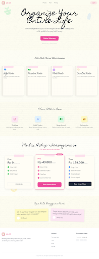

# Life OS

Life OS is a personal journaling and life management app built with Laravel, Inertia, React, and Tailwind CSS. The project explores a digital bullet journal experience with a scrapbook-style interface for planning, reflection, notes, habits, gratitude, and personal finance tracking.

## Preview



## What It Includes

- Landing page for the product concept
- Daily spread journal view
- Task log view
- Habit tracker view
- Gratitude journal view
- Notes workspace
- Idea dump workspace
- Finance tracker view
- Laravel Breeze-style authentication scaffolding

## Tech Stack

- PHP 8.2+
- Laravel 12
- Inertia.js
- React 18
- Vite
- Tailwind CSS
- SQLite for local development

## Project Status

This repository is currently in an early prototype stage.

- The UI is the most complete part of the project.
- Most journal pages are still static and not connected to persistent data models yet.
- Authentication scaffolding exists, but some default Breeze redirects still need to be aligned with the current routes.

## Local Setup

### 1. Install dependencies

```bash
composer install
npm install
```

### 2. Prepare environment

```bash
cp .env.example .env
php artisan key:generate
```

On Windows PowerShell, use:

```powershell
Copy-Item .env.example .env
php artisan key:generate
```

### 3. Create the database and run migrations

```bash
New-Item -ItemType File database/database.sqlite
php artisan migrate
```

If the SQLite file already exists, just run the migration command.

### 4. Start the app

Run the backend and frontend in separate terminals:

```bash
php artisan serve
npm run dev
```

Or use the combined Composer script:

```bash
composer run dev
```

## Available Scripts

- `composer run dev` - run Laravel server, queue worker, logs, and Vite together
- `npm run dev` - start Vite dev server
- `npm run build` - create a production frontend build
- `php artisan test` - run the test suite

## Routes

Main pages currently available:

- `/`
- `/daily-spread`
- `/task-log`
- `/habit-tracker`
- `/gratitude`
- `/notes`
- `/idea-dump`
- `/finances`

Authentication and profile routes are also included through Laravel Breeze/Inertia scaffolding.

## Repository Structure

```text
app/           Laravel controllers, middleware, models, requests
config/        Laravel configuration
database/      Migrations, factories, seeders, SQLite db for local use
resources/     React pages, layouts, components, and Tailwind CSS
routes/        Web and auth routes
stitch/        Source design exports and mockup assets
tests/         PHPUnit feature and unit tests
```

## Notes For Contributors

- `.env`, `vendor`, `node_modules`, build artifacts, and the local SQLite database are ignored from Git.
- The `stitch/` directory contains design references used to shape the UI.
- If you want to make the project production-ready, the highest-value next step is to connect one module end-to-end with real persistence.

## Next Suggested Milestones

- Add a real dashboard route and align auth redirects
- Persist task, note, gratitude, and finance data to the database
- Replace hardcoded journal content with user data
- Add CRUD flows for at least one module
- Expand automated test coverage beyond the default scaffold

## License

No dedicated license file has been added yet.
